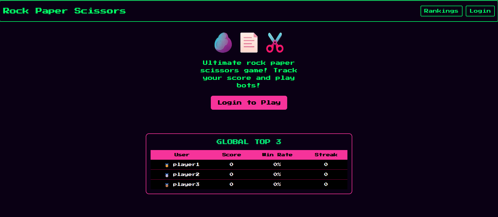
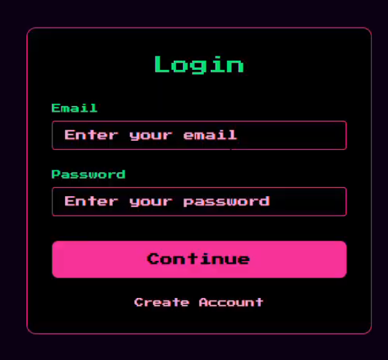
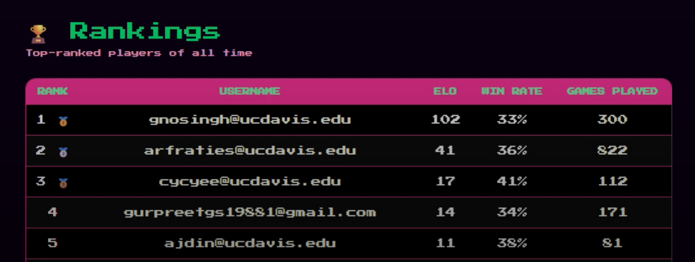
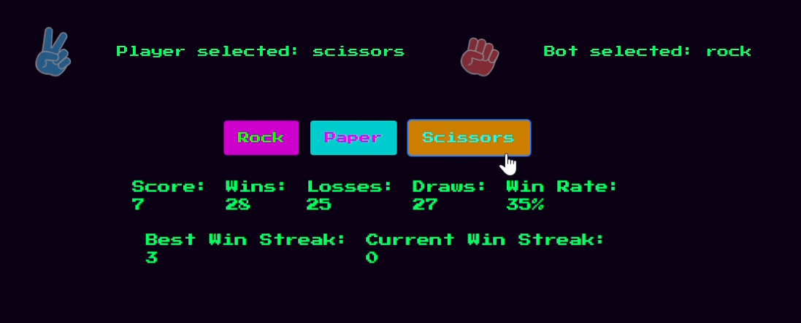
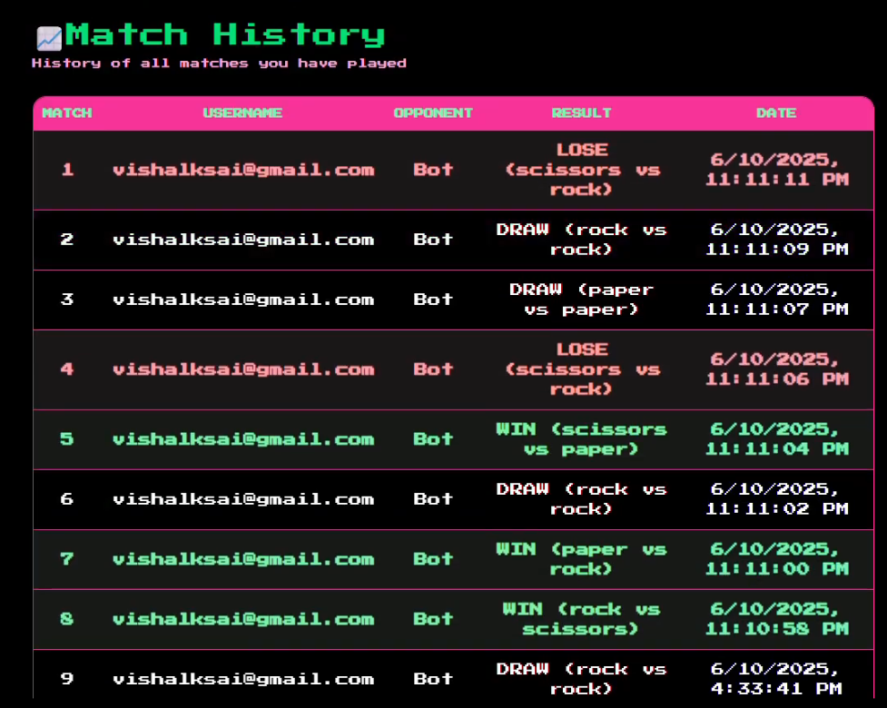

# React RPS Game 🎮✊📄✂️  

A **full-stack Rock-Paper-Scissors game** built with **Next.js (React)**, **Supabase**, and **Tailwind CSS**, featuring **user authentication**, **leaderboards**, and **match history tracking**. Includes **unit-tested frontend components** with Jest + React Testing Library.  

---
## Screenshots
### Main Page

### Login Page

### Rankings Page

### Game Page

### Match History Page

---
## Demo
https://github.com/user-attachments/assets/2c06d268-19b4-4f20-bfb4-1c62a9952a01

---

## 🚀 Features  

- **Authentication & Profiles**  
  - User sign-up/login via Supabase Auth  
  - Profile management with editable usernames  

- **Game Logic**  
  - Real-time Rock-Paper-Scissors gameplay against a bot  
  - Elo-like scoring system with win/loss/draw tracking  
  - Streak tracking (current & best streaks)  

- **Data & APIs**  
  - Supabase Postgres database with tables for:  
    - `player_stats` – global rankings & scores  
    - `game_history` – per-user match history  
    - `dummy` – example CRUD functionality for testing  
  - API routes (`/api/playerStats`, `/api/gameHistory`, etc.) for CRUD operations  

- **Leaderboard & Rankings**  
  - Global Top 3 shown on home page  
  - Rankings page with all players, win rates, games played, and medal indicators  

- **Match History**  
  - Personalized history page showing all previous matches (date, result, opponent, choices)  

- **Testing**  
  - Jest + React Testing Library  
  - Unit tests for HomePage and LoginPage (title, buttons, leaderboard fetch, login flow)  

---

## 🛠️ Tech Stack  

- **Frontend:** React, Next.js 14, Tailwind CSS  
- **Backend:** Supabase (Postgres + Auth)  
- **Auth:** Supabase Auth with cookies/session middleware  
- **Testing:** Jest, React Testing Library  
- **Deployment Ready:** Next.js App Router, API Routes  

---

## HOW TO RUN
Run these commands:
1) `npm install`
2) `npm run dev`
3) Go to `http://localhost:3000` on your browser

## HOW TO TEST
Run this command:
- `npm test`
